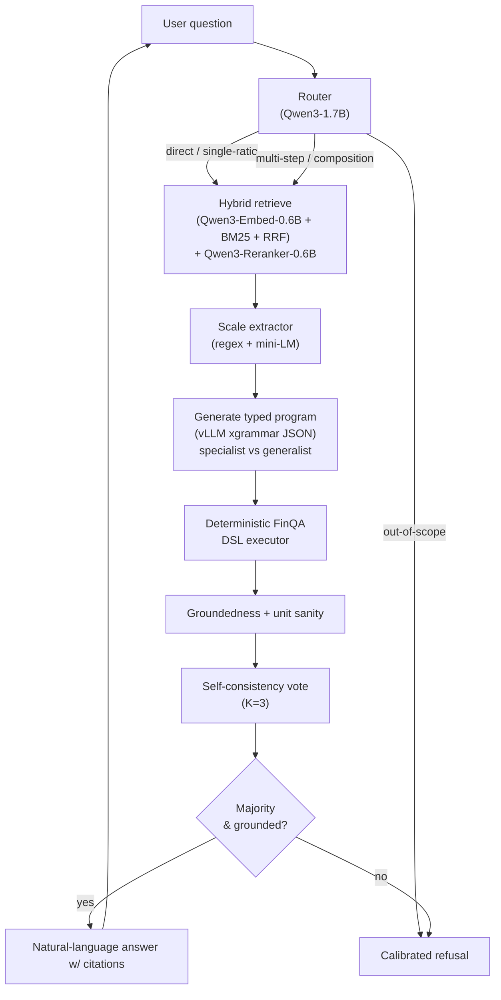

# FinQA Chatbot: Differentiated Architecture Plan

## 1. Critique of existing submissions (evidence-grounded)

Findings from reading the 6 linked repos in full. Only 5 are real (`varunmistry11/finqa-rag` is an empty repo — `size: 0`).

- **No one actually runs a GPU.** Four of five real repos hard-code `ChatOpenAI(model="gpt-4o-mini")` with no `base_url`. Only `Anirud-Mohan` wires `ChatOpenAI(base_url=VLLM_BASE_URL,...)` — and that repo has no `vllm serve` config, no quantization, no throughput numbers, and `scripts/run_eval.py` is literally `def main(): pass`. **Zero of six report a single GPU-side number.**
- **Tables are flattened.** `sakethbolla`, `grandprince`, `mahendruShivam29` serialize the whole table as one markdown blob. Only `Anirud-Mohan` chunks per row to match FinQA's `gold_inds`. Nobody extracts an explicit scale factor from the header ("( in millions )").
- **Unit/percent handling is post-hoc.** Every eval script does `try x*100 and x/100 and see which matches gold` instead of emitting typed `{value, form: percent|decimal, scale}`. Programs containing `const_100`/`const_1000` score **43.88% vs 61.24% overall** in FinQANet (Chen et al. Table 3) — this is the largest under-addressed failure slice.
- **No groundedness check anywhere.** No repo verifies that every literal number in the generated program actually appears in the retrieved context. Hallucinated numbers pass silently.
- **No self-consistency.** PoT-SC beat PoT by ~4 points on FinQA in the original PoT paper; nobody samples K programs and majority-votes.
- **Drift = LangSmith.** Only `sakethbolla` implements any drift test (KS on a 1-D random-projection of embeddings + KS on `log1p|answer|`); for everyone else, "drift detection" is "LangSmith is on."
- **Eval is serial and uncosted.** Every `eval.py` is `for sample in samples: graph.invoke(...)`. No `chain.batch`, no tokens/sec, no p50/p95/p99, no `$/correct answer`. `grandprince` also has a critical leak — `record_to_document` appends `Gold Answer: {gold_ans}` into the FAISS `page_content`, so every document contains its own answer.
- **Missed specialist model.** Nobody uses `rLLM/rLLM-FinQA-4B` (Apache 2.0, Jan 2026) — a Qwen3-4B GRPO-tuned with tool use that scores **59.7% on Snorkel Finance, beating `Qwen3-235B-A22B` at 51.4%**. Published SOTA on FinQA public test is **FINDER (EMNLP 2025) at 75.32%**; human experts 91.16%, MTurk 50.68%.

## 2. Differentiators (each addresses a specific weakness above)

### D1. Grammar-constrained typed DSL output via vLLM xgrammar

Instead of free-form Python PoT, the generator emits a JSON object validated by `xgrammar` (vLLM's unified `structured_outputs` API as of v0.12) against a Pydantic schema modeled on the FinQA DSL:

```python
class Step(BaseModel):
    op: Literal["add","subtract","multiply","divide","exp","greater",
                "table_sum","table_average","table_max","table_min"]
    args: list[Union[float, str]]     # numbers or "#n" back-references
    source: str                        # "table_3", "pre_text[2]", ...

class AnswerEnvelope(BaseModel):
    program: list[Step]
    answer_value: float
    answer_form: Literal["percent","decimal","ratio","currency","count"]
    scale: Literal["units","thousands","millions","billions"]
    grounded_numbers: list[float]      # every literal used
    confidence: float                  # model self-report
```

**Different because** every other repo emits free-form code and parses it with regex or `ast.parse`, spending a whole eval metric (`parse_fail_rate`) to track the failure. Grammar-constrained decoding makes parse failures impossible. **Matters for FinQA because** it (a) enables the official *program accuracy* metric via `sympy.simplify` on the executed tree, not just execution accuracy, and (b) makes `answer_form` and `scale` explicit first-class fields instead of guessed post-hoc.

### D2. Row-granular retrieval + explicit scale extraction

Chunk per-row tables matching FinQA's `gold_inds` keys (`text_i`, `table_i`), hybrid Qwen3-Embedding-0.6B + BM25 with RRF, then rerank with Qwen3-Reranker-0.6B. **Plus**: a `ScaleExtractor` node that parses table header strings ("( dollars in millions )", "( in thousands )") into a structured `{scale_factor: 1e6}` and passes it to the generator as typed metadata, not prompt prose.

**Different because** every other repo conflates scale into the prompt text; the LLM has to infer it every time. **Matters for FinQA because** `const_1000` / `const_1000000` appear in gold programs whenever the answer unit differs from the header unit, and this is the slice where the published baseline collapses from 61.24% to 43.88%.

### D3. Two-tier routed stack: tiny router → finance specialist OR general reasoner

- **Router**: `Qwen/Qwen3-1.7B` classifies the question into `{direct_lookup, single_ratio, multi_step, out_of_scope}` — under 200 ms on a T4.
- **Finance specialist**: `rLLM/rLLM-FinQA-4B` (Apache 2.0, BF16, ~8.8 GB) for direct-lookup and single-ratio — already RL-tuned on 10-K reasoning with native tool calling.
- **General reasoner**: `Qwen/Qwen3-8B-AWQ` (T4 default) / `Qwen/Qwen3-14B-AWQ` (L4) for multi-step and text+table composition.
- All served behind **one** `vllm serve` OpenAI-compatible endpoint; LangChain sees a single `base_url`, routing is a LangGraph conditional edge.

**Different because** every other repo uses one model for everything. **Matters for FinQA because** the paper reports **59.10% of questions are single-step** and **62.43% are table-only** — routing these to the 4B specialist saves ~3x tokens per query and ~3x latency while improving accuracy on the finance-tuned slice. On multi-step (8.19%) we pay for the 8B/14B. This is a production pattern, not novelty for its own sake.

### D4. Self-consistency + groundedness verifier + calibrated refusal

After generation: sample K=3 typed programs with temperature=0.6, execute each with the deterministic FinQA DSL executor, then:

- **Groundedness check**: every literal in `program.args` must match a number in the retrieved context under a number-normalization function that handles `$`, `,`, `%`, `(x)` → `-x`, `" million"`, `" billion"`.
- **Majority vote** on executed numeric answer (tolerance = rounded-to-5-decimals equality, matching the official `evaluate.py`).
- **Refusal gate**: if no majority OR groundedness fails on the winner, return a calibrated `"I cannot answer this confidently from the provided filing"` and log to the refusal metric.

**Different because** no repo implements groundedness or refusal; `mahendruShivam29` has an `"UNABLE_TO_ANSWER"` sentinel but never tracks its rate. **Matters for FinQA because** the paper's error analysis (Fig 4–5) shows the two dominant failure modes are hallucinated numbers and wrong row/year selection — both caught by grounding; and in a financial-decision context, a calibrated refusal is worth more than a confident wrong number.

### D5. vLLM inference-optimization track (the GPU-expertise showcase)

A measured ablation matrix, reported in `docs/GPU_BENCHMARK.md`, with numbers run on Colab:

- **Quantization** (L4): FP16 vs AWQ vs `awq_marlin` vs FP8 (Ada tensor cores) vs FP8 KV cache on top — report exe-accuracy, tokens/sec at batch=1 and batch=8, TTFT, p95 latency. Background: Marlin-AWQ 741 tok/s vs non-Marlin AWQ 68 tok/s on H200 Qwen2.5-32B (jarvislabs.ai benchmark) — a 10x kernel-level delta.
- **Prefix caching**: `--enable-prefix-caching` on/off, with prompts structured as `[static_system + few_shots | retrieved | question]` specifically to maximize cache hits. Measure hit-rate using vLLM's `/metrics` endpoint.
- **Chunked prefill** (default-on in V1): leave enabled, document the ITL stability win.
- **Batched eval**: replace serial `for row in samples: graph.invoke()` with `asyncio.gather(*[graph.ainvoke(...) for ...])` using LangChain 0.3 `abatch`. Measure queries/sec.
- **Speculative decoding**: n-gram speculator on the final `format_answer` node (the classic speculative-decoding shape — short, predictable output). Document P-EAGLE (vLLM v0.16) as the production-next step.
- **Headline metric**: **cost per correct answer** vs an OpenAI `gpt-4o-mini` baseline on the same dev-200 slice. Nobody in the comparison set reports this.

**Different because** none of the 6 submissions measures any of this. **Matters for the role** because this is literally what the job description asks: "benchmark LLM inference workloads," "optimize inference performance, latency, throughput, GPU utilization," "contribute to telemetry instrumentation."

### D6. Production-grade drift detection (not KS-on-random-projection)

Concrete signals logged to a Prometheus endpoint alongside vLLM's:

- **Input drift**: PSI (population stability index) on topic clusters of incoming questions vs the training distribution. Thresholds: <0.1 stable / 0.1–0.2 moderate / >0.2 alert (community standard).
- **Retrieval drift**: rolling-window hit-rate@k on a held-out 50-question golden set with frozen `gold_inds`.
- **Output drift**: distribution over (program length, operator mix, refusal rate, groundedness rate) — all features the other repos don't compute.
- **Calibration drift**: self-consistency agreement as a confidence proxy, binned against correctness on the golden set.
- All exposed via a FastAPI `/metrics` endpoint; dashboard JSON checked into `ops/grafana/`.

## 3. Architecture




All nodes are LangGraph `StateGraph` nodes over a typed `TypedDict`; checkpointer is `SqliteSaver` in dev, `PostgresSaver` in prod. Generator calls go through `ChatOpenAI(base_url=VLLM_BASE_URL)` — one env var flips Colab to production.

## 4. Stack (Colab-runnable, production-shaped)

**Default (T4, 16 GB)** — everything clone-and-run:

- Generator (general): `Qwen/Qwen3-8B-AWQ` — Apache 2.0, ~5.2 GB weights, native tool calls ([HF](https://huggingface.co/Qwen/Qwen3-8B-AWQ)).
- Generator (finance specialist): `rLLM/rLLM-FinQA-4B` — Apache 2.0, BF16 ~8.8 GB ([HF](https://huggingface.co/rLLM/rLLM-FinQA-4B)).
- Router: `Qwen/Qwen3-1.7B` — Apache 2.0, BF16 ~3.4 GB.
- Embedder: `Qwen/Qwen3-Embedding-0.6B` — MTEB-class, 1024 dim.
- Reranker: `Qwen/Qwen3-Reranker-0.6B` — causal-LM yes/no scoring, vLLM-compatible.
- vLLM flags: `--quantization awq --max-model-len 8192 --gpu-memory-utilization 0.85 --enable-prefix-caching --max-num-seqs 8 --disable-log-requests`.

**Optional (L4, 24 GB) — for the headline ablations**:

- Generator (general): `Qwen/Qwen3-14B-AWQ` with `--quantization awq_marlin` (Ada Marlin path).
- Add `--kv-cache-dtype fp8_e4m3` (Ada FP8 tensor cores).
- Run FP16 vs AWQ vs Marlin-AWQ vs FP8 throughput-and-accuracy ablation here.

**Serving**:

- Colab: `vllm serve` on `0.0.0.0:8000` + `cloudflared` tunnel for the demo UI; falls back to offline `LLM(...)` if tunneling is blocked.
- Production: same `vllm serve` command, behind a K8s `Service` with an HPA on `kv_cache_usage_perc` and a `PodDisruptionBudget`.

**UI**: Gradio `ChatInterface` with token streaming for the demo (fastest Colab UX), backed by a FastAPI `/chat` SSE endpoint so the graph is exposed as a real service — the Gradio UI is just one client. Chat messages render citations (which `gold_inds`-style chunks were used) and the typed program tree.

## 5. Evaluation strategy and ablations

**Primary metrics**:

- Execution accuracy — exact replica of `[czyssrs/FinQA/code/evaluate/evaluate.py](https://github.com/czyssrs/FinQA/blob/main/code/evaluate/evaluate.py)`, `round(ans, 5)` + `==` for gold equality, `str_to_num` replicating the percent-divided-by-100 convention.
- Program accuracy — nested-form parse + `sympy.simplify` equality (matches official metric).
- Retrieval recall@k and full-recall@k against `gold_inds`.

**Secondary (production-grade) metrics**:

- Unit correctness (separate from value correctness).
- Groundedness rate (% of programs where every arg appears in retrieved context).
- Refusal rate on a 20-question adversarial "row-deleted" slice (test-set questions with the gold row removed from the table).
- Calibration: confidence (self-consistency agreement) vs correctness, binned 5 ways.
- LLM-as-judge on a 25-sample rubric — yes/no subquestions only, not free-form grading (judge: Qwen3-14B-AWQ self-hosted, not OpenAI).

**Ablations (each one removes one component; all run on FinQA dev slice of 200 samples)**:

1. *D1*: typed output → free-form PoT. Expect parse-fail rate ~5–10% → 0%; exe-acc ~+2–4 pts from eliminating parse failures.
2. *D2*: scale extractor off. Expect large regression on questions with `const_100`/`const_1000` in gold programs (~15% of dev).
3. *D3*: router off, always-14B. Expect ~~0 pt accuracy change, **~~2.5× latency, ~3× cost** — the whole point.
4. *D4*: K=1 (no self-consistency). Expect ~3–4 pt exe-acc drop (matches PoT-SC literature).
5. *D4*: groundedness off. Expect stable exe-acc but spike in "confident wrong numbers" on adversarial set.
6. *D5*: prefix-cache off. Expect p50 TTFT ~2× higher on the dev run.
7. *D5*: FP16 vs AWQ vs awq_marlin vs FP8 (L4 only). Report accuracy ± 0.5 pt band and throughput spread.
8. *Baseline*: OpenAI `gpt-4o-mini` end-to-end. Report `$/correct` ratio.

All ablation numbers go into `docs/ABLATIONS.md` as a single table with 95% CIs (bootstrap over dev samples).

## 6. Production bridge

Component-by-component, what changes / what stays:

- **Generator**: stays `ChatOpenAI(base_url=...)` — one env var (`VLLM_BASE_URL`) flips from Colab tunnel to production K8s Service. vLLM server config in `configs/vllm_*.yaml` is the same shape; only `--tensor-parallel-size` and replica count change.
- **Retrieval**: Colab local FAISS + sentence-transformers → Qdrant + TEI/Infinity on GPU. Row-granular chunks and `gold_inds`-shaped metadata unchanged.
- **Checkpointing**: `SqliteSaver` → `PostgresSaver`; thread_id already a first-class state field.
- **Observability**: Colab prints vLLM `/metrics` + local Prometheus exporter → production Prometheus + Grafana with the dashboard JSON in `ops/grafana/`. OpenTelemetry spans (via Phoenix) are framework-agnostic and portable.
- **Eval harness**: dev-time CLI → CI/CD golden-set regression with accuracy gates. Ablation runner is already parameterized.
- **Baked in vs deferred**:
  - Baked in: OpenAI-compatible endpoint abstraction, typed state, grammar-constrained decoding, golden-set eval, drift metrics endpoint.
  - Deferred: LMCache/CacheBlend (documented in `docs/PRODUCTION.md` as the next-step TTFT win for RAG), disaggregated prefill, multi-replica KV-cache-aware routing (`llm-d`), MCP tool-server handoff.

## 7. Repository layout (production-quality scaffolding)

```
finqa-chatbot/
  README.md                        # problem, stack, one-command Colab, results table
  setup.sh                         # clone + install + vLLM serve + UI, one command
  pyproject.toml                   # uv / pip-compatible, pinned, typed
  configs/
    t4.yaml                        # default Colab config
    l4.yaml                        # optional GPU-ablation config
    eval.yaml                      # eval slices, ablation names
  docs/
    TECHNICAL_REPORT.md            # the assignment's "Technical Report" deliverable
    ABLATIONS.md                   # D1-D6 ablation results w/ 95% CIs
    GPU_BENCHMARK.md               # quantization, prefix-cache, throughput matrix
    PRODUCTION.md                  # K8s deploy, LMCache, disaggregated prefill
    ARCHITECTURE.md                # LangGraph diagram, data contracts
  src/finqa_bot/
    config.py                      # pydantic BaseSettings
    types.py                       # Step, AnswerEnvelope, TableChunk, GraphState
    serving/
      vllm_launcher.py             # reproducible `vllm serve` config
      openai_client.py             # ChatOpenAI wrapper w/ base_url + backoff
    retrieval/
      indexer.py                   # row-granular chunking matching gold_inds
      hybrid.py                    # dense + BM25 + RRF
      rerank.py                    # Qwen3-Reranker (vLLM /rerank when available)
      scale_extractor.py           # per-table scale factor -> typed metadata
    graph/
      state.py                     # TypedDict state
      nodes.py                     # router, retrieve, scale, generate, execute,
                                   # verify, consistency, format, refuse
      graph.py                     # compile LangGraph StateGraph
    execution/
      dsl.py                       # FinQA DSL parser (add,subtract,...,table_*)
      executor.py                  # deterministic executor + sympy verification
    verification/
      groundedness.py              # literal-in-context check + normalization
      units.py                     # percent/decimal/scale sanity
    monitoring/
      drift.py                     # PSI + retrieval hit-rate + operator-mix
      calibration.py               # confidence vs correctness bins
      metrics.py                   # Prometheus exporter (FastAPI /metrics)
    eval/
      finqa_metric.py              # exact replica of official evaluate.py
      program_metric.py            # sympy.simplify equality
      harness.py                   # batched async eval w/ chain.abatch
      ablations.py                 # named ablation runner
      slices.py                    # dev-200, adversarial-row-deleted, etc.
    ui/
      api.py                       # FastAPI + SSE /chat
      gradio_app.py                # Gradio ChatInterface client
    cli.py                         # typer: ingest, serve, eval, demo, bench
  tests/
    test_dsl_executor.py           # the full 10-op DSL w/ gold programs
    test_groundedness.py           # number-normalization edge cases
    test_scale_extractor.py        # "(in millions)" variants
    test_retrieval_recall.py       # recall@k on gold_inds
    test_structured_output.py      # grammar validation round-trip
    test_integration_smoke.py      # end-to-end single-question
  scripts/
    setup_colab.sh                 # apt + pip + HF login + start services
    run_eval.py                    # dev/test eval with slice selection
    run_ablations.py               # reproduces the ABLATIONS.md table
    run_gpu_benchmark.py           # reproduces the GPU_BENCHMARK.md matrix
  ops/
    grafana/finqa_dashboard.json   # vLLM + FinQA metrics dashboard
    prometheus/finqa_rules.yaml    # alert rules (KV>90%, refusal spike, hit-rate drop)
  data/.gitkeep                    # downloaded automatically by `scripts/setup_colab.sh`
```

## 8. What the "one-command Colab setup" looks like

```bash
git clone <repo> && cd finqa-chatbot
bash setup.sh                     # installs deps, downloads FinQA, pulls models,
                                  # starts vLLM server, starts FastAPI, opens Gradio
```

`setup.sh` is idempotent, prints a clear URL, and handles the T4-vs-L4 detection by reading `nvidia-smi` and picking `configs/t4.yaml` or `configs/l4.yaml` automatically. Failure modes (e.g. no GPU, OOM, port collision) have explicit error messages with a suggested fix.

## 9. Risks and mitigations

- **Qwen3-14B-AWQ on T4 is a stretch** (9 GB weights + 8k ctx KV cache). Default to Qwen3-8B-AWQ on T4; 14B-AWQ is the L4-only ablation. Documented in `configs/`.
- **vLLM Turing AWQ is non-Marlin** (slower kernel). Mitigation: the headline quantization ablation runs on L4; T4 demo uses plain AWQ and we document the kernel-arch relationship rather than hide it.
- **rLLM-FinQA-4B has no official AWQ checkpoint.** Run it in BF16 (fits T4 at 4k ctx by itself; on L4 there is headroom to co-serve with the 14B). If VRAM contention emerges, quantize locally via AutoAWQ; documented as a day-5 task only if needed.
- **Cloudflared/ngrok tunnels can flake on Colab.** Gradio's built-in `share=True` is the fallback path; documented in `README.md`.
- **CodaLab test-set evaluation** requires a submission; default to FinQA dev for all numbers and document test-set access as optional.

PLS NOTE FOR EACH CODE EXECUTION KEEP STRCUTURED LOGGING PRODUCTION LEVEL, AND ALSO MAINTAIN A LOGS.TXT FILE THAT DISPLAYS EVERYHTHING. KEEP THE GRADIO UI CLEAN